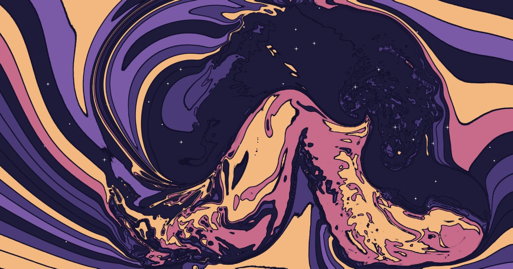

# swirlfluid

Stir a posterized swirl fluid in your browser. **Live: https://angusforbes.github.io/swirlfluid/**

Flat poster-coloured swirl bands painted onto a real fluid simulation: stirring marbles them like paper, and when
left alone the picture slowly heals back to its original pattern. Each square or band slowly fades into new colours on its own clock (colour fade).

Two engines share the page: **swirl** (the poster fluid, with Ice Cracks, Cubism, Silk, ...) and **fluid automata**
(an 8-bit energy automaton smearing a background, see below). Pick a preset from either row; `e` swaps engines.

## Controls

| | desktop | phone / tablet |
|---|---|---|
| stir | drag | one finger |
| spin a whirlpool | hold `Shift`+`→` (clockwise) or `Shift`+`←` (anticlockwise); spins under the cursor | press and hold still; or twist two fingers (either way) |
| presets | `1`–`9` or the buttons | buttons |
| swap engine | `e` or click a row's label | tap the other row's label |
| background / vectors (automata) | `b` / `v`, or drop an image | buttons in **tune** |
| palette | `p` or the dots in **tune** | dots in **tune** |
| fill (what gets stirred) | `f` or the **fill** buttons in **tune** | **fill** buttons in **tune** |
| tune panel | `t` | **tune** button |
| reset / save PNG / hide help | `space` / `s` / `h` | buttons in **tune**; tap to bring the help back |

**copy link** in the tune panel copies a URL with your settings, e.g. `?preset=Jupiter&palette=sea&curl=12`
or `?engine=automata&profile=Milky%20Way&blend=0.9`.

## Presets and knobs

Nine presets: Poster, Tar, Ice Cracks, Cubism, Silk, Kaleidoscope, Jupiter, Watercolour, Milky Way.

The page opens on **squares** at a low-to-medium resolution (about 24 rows). Palettes have 8 colours each: the
original eight (ocean, dusk, navygold, wine, sea, ice, cubist, tar), four bright ones (pop, candy, tropic, neon) and
four pastels (pastel, sorbet, mint, light pastel).

**fill** sets what the swirl engine stirs: **bands** (poster bands), **field** (smooth noise through the palette),
**blobs** (posterized noise with ink outlines), **squares** (a grid of squares, each a random palette colour) or
**colour noise** (squares in random full colours). The **resolution** slider pixelates any fill, from 4 rows of rectangles to 1 px; the cells are stirred with the fluid. Click the selected fill again (or `r`) for a new random one. Noise fills start
straight (no swirl warp); every reset draws new noise, and the bands get a new random swirl layout. The fill and square
size stay when you change preset; the palette colours them. Try `?preset=Ice%20Cracks&fill=squares&cell=24`.
The knobs take ideas from [Fluid Automata](https://github.com/CreativeCodingLab/FluidAutomataJS)
(Forbes, Höllerer, Legrady, *Generative fluid profiles for interactive media arts projects*, CAe 2013), reworked
for this renderer:

- **fluidity**: how long motion lasts (1.000: forever, the idle eddies stop, and thickness and branching stop shaping the motion a moment after you let go, so with fluids off the picture stays exactly as you leave it) · **thickness**: velocity spreads into its neighbours (tar)
- **branching** / **branch angle**: part of the motion peels off sideways at an angle
- **energy**: how far paint is carried · **curl**: how hard small eddies are kept spinning
- **heal**: how fast the picture relaxes back
- **lattice**: off = a smooth fluid; N = Fluid Automata's own lattice (used by Ice Cracks and Cubism): N×N cells,
  each holding a vector that is handed on to its neighbours by overlap, and the picture is redrawn each frame through
  that coarse mesh with every vertex shifted by its vector, so it tears along triangle edges · **memory**: how much of
  the last frame survives each lattice frame
- **carry**: how hard the lattice drags the bands underneath · **jitter**: irregular lattice · **facets**: each triangle
  moves its piece rigidly with its own shade (Cubism)
- **crisp ink**: pulls smeared ink back toward the palette so it keeps hard edges · **wash**: draw bands as watercolour
- **outline**: a dark line around every colour region of the finished picture, the colours inside left clean (pairs well with wash off)
- **bands**: band density · **colour fade**: one slider with two knobs, the shortest and longest time (seconds) a square or band takes to fade into a randomly chosen palette colour; each takes its own time in between. Left knob at 0 = off
- **fluids** off: motion stays where you put it (a displacement) instead of flowing on
- **ink**: colours smear and blend instead of staying crisp poster bands

## How it works

`swirl2.js` is a stable-fluids solver in WebGL2 (advection, vorticity confinement, pressure projection). Instead
of dye it carries a texture of *material coordinates*; the display shader turns those coordinates into flat colour
bands with outlines, so the bands stay crisp however much they are stirred. Ink mode carries a colour image instead.
No dependencies or build step: open `index.html` straight from disk. The first version lives at [`classic/`](classic/).

## Fluid Automata engine ([`automata.js`](automata.js))

A loose re-creation of Fluid Automata (Forbes, Höllerer, Legrady, CAe 2013) on the GPU: a grid of 8-bit energy
vectors (256 orientations x 256 magnitudes); each step a cell's energy splits into forward / left / right streams
(forward share, left:right split, angularity), each stream displaces a copy of the cell and hands partials to the cells
it overlaps, then everything is damped (fluidity). Optional max outflow, jitter, wrap-around or bouncing walls. The
image is a feedback loop: the previous frame distorted by the field, blended with a background (colour / grey / b&w
noise, palette noise fields, the swirl's poster bands, live noise, camera, or a dropped image), then saturation, brightness and contrast.
Profiles are the original JS presets plus a few from the paper (fine grids, max outflow, jitter, low-res b/w smear).
`v` shows the vectors. The noise uses an integer hash, so it stays random across the whole screen. The old
`automata/` address forwards here.

## Licence

Apache-2.0
